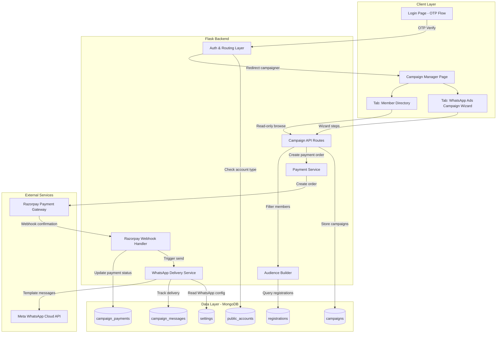
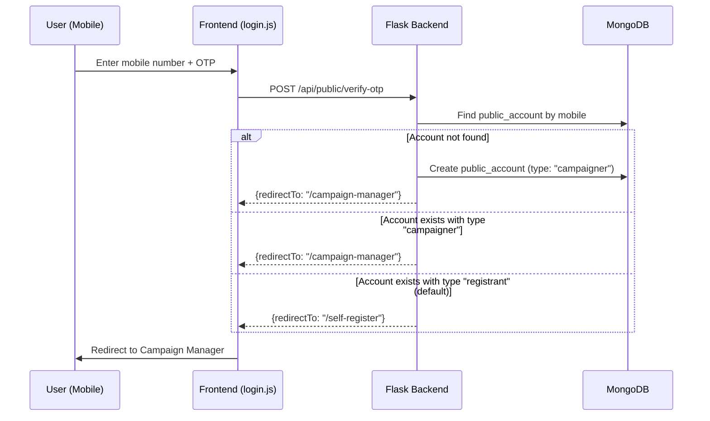
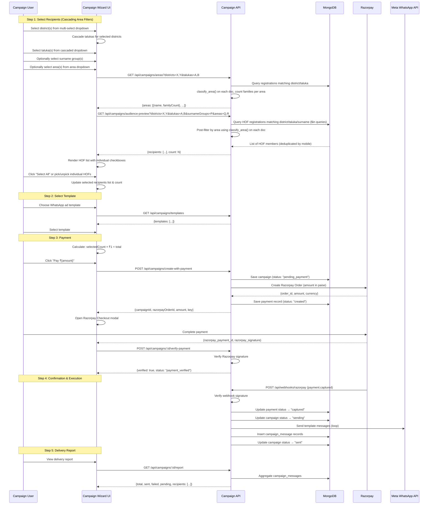
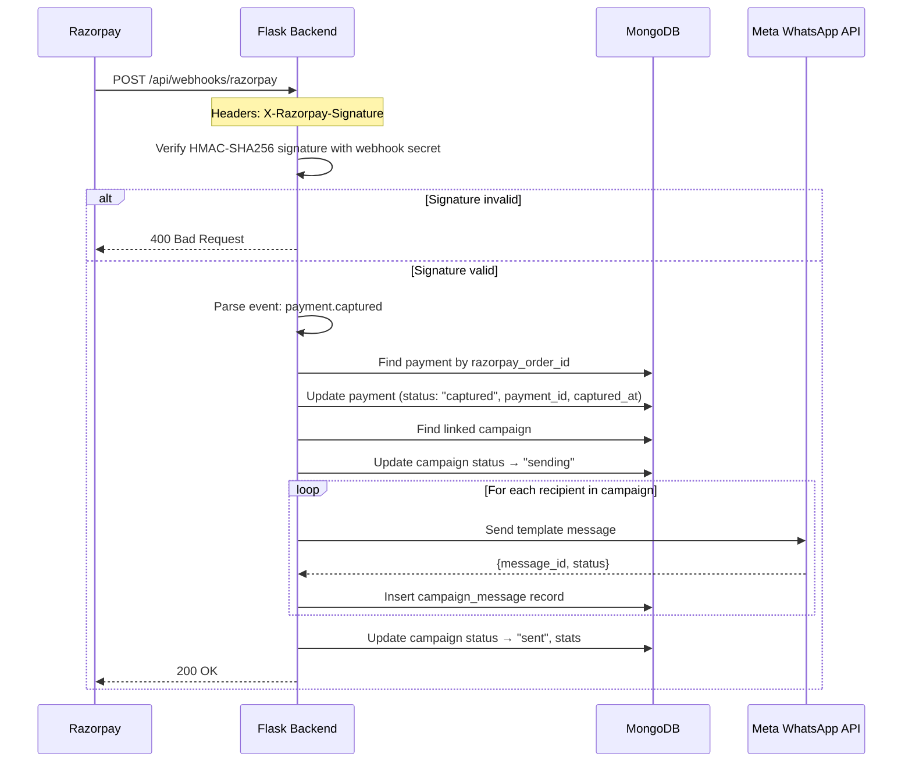

# Design Document: Campaign Manager

## Overview

The Campaign Manager feature provides a dedicated page (`/campaign-manager`) with a tabbed interface for campaigner users. After OTP-based mobile login, users with the "campaigner" account type are redirected here instead of `/self-register`. The page contains three tabs: **Member Directory** (read-only browsing of registered samaj members), **WhatsApp Ads Campaign** (a multi-step wizard for creating and sending paid WhatsApp ad campaigns), and a **Logout** button.

The WhatsApp Ads Campaign tab implements a 5-step wizard: (1) Select area filters (District, Taluka, Surname Group, and Area) and individual HOF recipients, (2) Select WhatsApp ad template, (3) Payment via Razorpay at ₹1 per recipient, (4) Confirmation and campaign execution after payment webhook confirmation, (5) Full delivery status report. Campaigns are only executed AFTER Razorpay payment is confirmed via webhook, ensuring no messages are sent without payment.

The "Area" filter classifies registrations into localities based on keyword matching in address fields (address1 + address2) using the existing `classify_area()` function from `data_tools.py`. Since Area is NOT a stored MongoDB field (it's computed from address text), area filtering happens post-query in Python after the initial district/taluka/surname MongoDB query.

The system uses the existing Meta WhatsApp Cloud API integration (already configured for OTP) extended for bulk template delivery, and integrates Razorpay for payment processing. Campaign data, payment records, and per-recipient delivery statuses are stored in MongoDB.

## Architecture



## Sequence Diagrams

### Login & Redirect Flow



### Campaign Wizard Flow (Steps 1-5)



### Razorpay Webhook Flow (Detailed)



## Components and Interfaces

### Component 1: Auth & Routing (Modified)

**Purpose**: Extend existing OTP verification to support a new account type "campaigner" and redirect accordingly.

**Interface**:
```python
def verify_public_otp():
    """Modified: After OTP verification, check account_type to determine redirect."""
    # ... existing OTP verification logic ...
    # NEW: determine redirect based on account_type
    redirect_to = get_redirect_for_account(account)
    return jsonify({"ok": True, "redirectTo": redirect_to})

def get_redirect_for_account(account: dict) -> str:
    """Return the appropriate redirect URL based on account type and status."""
    ...

def is_campaigner_session() -> bool:
    """Check if current session belongs to a campaigner account."""
    ...
```

**Responsibilities**:
- Determine account type on OTP verification
- Redirect campaigners to `/campaign-manager`
- Protect campaign routes with session checks

### Component 2: Campaign Manager Page (Tabbed UI)

**Purpose**: Serve the campaign manager page with tabbed interface.

**Interface**:
```python
@app.route("/campaign-manager")
def campaign_manager_page():
    """Render the campaign manager template with tabbed layout."""
    if not is_campaigner_session():
        return redirect("/login")
    return render_template("campaign-manager.html")
```

**UI Layout**:
```
┌─────────────────────────────────────────────────────────┐
│  SAMAJ LOGO                                             │
├──────────────────┬──────────────────────────┬───────────┤
│ Member Directory │ WhatsApp Ads Campaign    │  Logout   │
├──────────────────┴──────────────────────────┴───────────┤
│                                                         │
│  [Tab Content Area]                                     │
│                                                         │
└─────────────────────────────────────────────────────────┘
```

**Responsibilities**:
- Render tabbed interface (Member Directory, WhatsApp Ads Campaign, Logout)
- Member Directory tab: read-only view with search/filter (reuses existing directory API)
- WhatsApp Ads Campaign tab: multi-step wizard UI

### Component 3: Campaign Wizard (Frontend - 5 Steps)

**Purpose**: Guide user through campaign creation with a step-by-step wizard.

**Steps**:
```
Step 1: Select Recipients (Cascading Area Filters + Individual Selection)
  ┌──────────────────────────────────────────────────────────────────┐
  │  FILTERS                                                         │
  │  ┌───────────────────┐  ┌───────────────────┐  ┌─────────────┐ │
  │  │ District (multi)  │  │ Taluka (multi)    │  │ Surname Grp │ │
  │  │ ☑ Washim          │  │ ☑ Washim          │  │ ☐ Patil     │ │
  │  │ ☑ Amravati        │  │ ☑ Malegaon        │  │ ☐ Jadhav    │ │
  │  │ ☐ Akola           │  │ ☐ Mangrulpir      │  │ ☐ Deshmukh  │ │
  │  │ ☐ Buldhana        │  │ ☑ Achalpur        │  │             │ │
  │  │ ☐ Yavatmal        │  │ ☐ Morshi          │  │             │ │
  │  └───────────────────┘  └───────────────────┘  └─────────────┘ │
  │  ┌──────────────────────────────────────────────────────────────┐│
  │  │ Area (multi) - computed from address keywords                ││
  │  │ ☐ Kata (12 families)                                        ││
  │  │ ☑ Lakhala (other) (45 families)                             ││
  │  │ ☑ Civil Lines (8 families)                                  ││
  │  │ ☐ Tirupati City (Akola Road) (15 families)                  ││
  │  │ ☐ Shukrawar Peth / Baheti Galli (22 families)               ││
  │  │ ☐ IUDP Colony (10 families)                                 ││
  │  │ ☐ Unclassified (30 families)                                ││
  │  │ ...                                                          ││
  │  └──────────────────────────────────────────────────────────────┘│
  │                                                                  │
  │  [Apply Filters]                                                 │
  ├──────────────────────────────────────────────────────────────────┤
  │  RECIPIENTS (showing 45 of 120 total HOFs)                       │
  │  ┌──────────────────────────────────────────────────────────────┐│
  │  │ ☑ Select All (45)                                            ││
  │  ├──────────────────────────────────────────────────────────────┤│
  │  │ ☑  Ramesh Patil       | Washim, Washim     | 98XXXX3210    ││
  │  │ ☑  Suresh Jadhav      | Washim, Malegaon   | 98XXXX3211    ││
  │  │ ☐  Ganesh Deshmukh    | Amravati, Achalpur | 97XXXX4422    ││
  │  │ ☑  Mahesh Patil       | Amravati, Achalpur | 90XXXX5533    ││
  │  │ ...                                                          ││
  │  └──────────────────────────────────────────────────────────────┘│
  │                                                                  │
  │  Selected: 43 recipients                          [Next →]       │
  └──────────────────────────────────────────────────────────────────┘

  Filter Behavior:
  - District dropdown: multi-select with checkboxes. Options from LOCATION_DATA.
  - Taluka dropdown: cascaded from selected districts. Shows only talukas
    belonging to currently selected districts. Multi-select with checkboxes.
  - Surname Group dropdown: optional, multi-select. Populated from distinct
    surnameGroup values in registrations collection.
  - Area dropdown: optional, multi-select. Populated from /api/campaigns/areas
    endpoint which classifies registrations using classify_area() and returns
    area names with family counts. Shows all areas from AREA_RULES that have
    at least one matching family in the current district/taluka selection.
    Includes "Unclassified" for addresses that match no rule.
    NOTE: Area is computed from address text, NOT a stored MongoDB field.
  - "Apply Filters" button fetches matching HOF records from API.
    When areas are selected, the backend first queries by district/taluka/surname
    via MongoDB, then post-filters results by running classify_area() on each
    document and keeping only those whose computed area is in the selected list.
  - HOF list renders with individual checkboxes per row.
  - "Select All" checkbox toggles all currently visible/filtered HOFs.
  - User can individually pick/unpick specific HOFs after Select All.
  - Selected count updates live as checkboxes change.
  - Filters are independent: if no district selected, all districts shown.
    If no taluka selected, all talukas for selected districts shown.
    If no area selected, all areas included (no area filtering applied).

Step 2: Select Template
  - List of available WhatsApp ad templates
  - Template preview
  
Step 3: Payment
  - Summary: "{N} recipients × ₹1 = ₹{N}"
  - "Pay ₹{amount}" button → Razorpay Checkout
  
Step 4: Confirmation
  - Payment confirmed indicator
  - "Campaign is being sent..." progress
  - Waiting for webhook-triggered execution
  
Step 5: Delivery Report
  - Summary stats (sent/failed/pending)
  - Per-recipient status table
```

### Component 4: Campaign API Routes

**Purpose**: Backend API endpoints for campaign wizard flow.

**Interface**:
```python
@app.get("/api/campaigns/audience-preview")
def audience_preview():
    """
    Return HOF members matching cascading area filters for selection.
    
    Query params:
        districts: comma-separated list of districts (optional)
        talukas: comma-separated list of talukas (optional)
        surnameGroups: comma-separated list of surname groups (optional)
        areas: comma-separated list of area names (optional, post-filter)
    
    Returns: {recipients: [...], count: N}
    
    NOTE: When 'areas' param is provided, the backend first queries by
    district/taluka/surname via MongoDB, then post-filters in Python by
    running classify_area() on each document's address1+address2 fields.
    Area is NOT a stored field — it's computed from address text.
    """
    ...

@app.get("/api/campaigns/areas")
def list_areas():
    """
    Return available area names with family counts for the Area filter dropdown.
    Reuses classify_area() from data_tools to classify each registration's area.
    
    Query params:
        districts: comma-separated list of districts (optional)
        talukas: comma-separated list of talukas (optional)
    
    Returns: {areas: [{name: str, familyCount: int}, ...]}
    
    Implementation:
        1. Query registrations matching district/taluka filters (MongoDB)
        2. For each doc, compute area via classify_area(address1, address2)
        3. Group by area, count distinct families (by mobileNumber)
        4. Return sorted list of {name, familyCount}
    
    NOTE: This performs classification on-the-fly since area is not stored.
    Results are scoped to the current district/taluka selection.
    """
    ...

@app.get("/api/campaigns/surname-groups")
def list_surname_groups():
    """
    Return distinct surnameGroup values from registrations.
    Optionally filtered by district/taluka.
    
    Query params:
        districts: comma-separated list of districts (optional)
        talukas: comma-separated list of talukas (optional)
    
    Returns: {surnameGroups: ["Patil", "Jadhav", ...]}
    """
    ...

@app.get("/api/campaigns/templates")
def list_templates():
    """Return available WhatsApp ad templates."""
    ...

@app.post("/api/campaigns/create-with-payment")
def create_campaign_with_payment():
    """
    Create campaign + Razorpay order in one step.
    Body: {recipients: [...], templateName, templateLanguage, bodyVars}
    Returns: {campaignId, razorpayOrderId, amount, razorpayKey}
    """
    ...

@app.post("/api/campaigns/<campaign_id>/verify-payment")
def verify_payment(campaign_id: str):
    """
    Verify Razorpay payment signature (client-side verification).
    Body: {razorpay_payment_id, razorpay_order_id, razorpay_signature}
    """
    ...

@app.get("/api/campaigns/<campaign_id>/report")
def campaign_report(campaign_id: str):
    """Get full delivery status report for a campaign."""
    ...

@app.get("/api/campaigns")
def list_campaigns():
    """Return all campaigns for the current user."""
    ...

@app.get("/api/campaigns/<campaign_id>")
def get_campaign(campaign_id: str):
    """Get campaign details including status and stats."""
    ...
```

**Responsibilities**:
- Audience preview with cascading multi-filters for recipient selection (Step 1)
- Area listing with family counts for filter dropdown population (Step 1)
- Surname group listing for filter dropdown population (Step 1)
- Template listing (Step 2)
- Campaign + payment order creation (Step 3)
- Client-side payment signature verification (Step 3)
- Delivery report (Step 5)
- Campaign listing and detail

### Component 5: Payment Service (Razorpay)

**Purpose**: Handle Razorpay order creation, verification, and webhook processing.

**Interface**:
```python
def create_razorpay_order(amount_inr: int, campaign_id: str) -> dict:
    """
    Create a Razorpay order for the given INR amount.
    
    Args:
        amount_inr: Amount in INR (e.g., 100 for 100 recipients)
        campaign_id: Campaign reference for receipt
    
    Returns:
        {"order_id": str, "amount": int (paise), "currency": "INR", "key": str}
    """
    ...

def verify_razorpay_signature(
    order_id: str,
    payment_id: str,
    signature: str
) -> bool:
    """
    Verify Razorpay payment signature using HMAC-SHA256.
    
    Returns True if signature is valid.
    """
    ...

def handle_razorpay_webhook(payload: dict, signature: str) -> bool:
    """
    Process Razorpay webhook event.
    Verifies signature, updates payment record, triggers campaign send.
    
    Returns True if processed successfully.
    """
    ...
```

**Responsibilities**:
- Create Razorpay orders with correct amount (recipients × 100 paise)
- Verify payment signatures (client-side and webhook)
- Update payment records on webhook confirmation
- Trigger campaign execution ONLY after webhook payment.captured event

### Component 6: Audience Builder

**Purpose**: Resolve target audience from registration data based on cascading area filters (district → taluka → surname group → area), returning HOF records for checkbox selection. The Area filter uses `classify_area()` from `data_tools.py` to compute area from address text (not a stored field).

**Interface**:
```python
def get_hof_by_area(filters: dict, collection) -> list[dict]:
    """
    Query registrations and return HOF (Head of Family) records for selection.
    Supports cascading multi-select filters including computed area filter.
    
    Args:
        filters: {
            "districts": list[str] | None,      # e.g. ["Washim", "Amravati"]
            "talukas": list[str] | None,        # e.g. ["Washim", "Malegaon", "Achalpur"]
            "surnameGroups": list[str] | None,  # e.g. ["patil", "jadhav"]
            "areas": list[str] | None,          # e.g. ["Civil Lines", "Lakhala (other)"]
        }
        collection: MongoDB registrations collection
    
    Returns:
        List of {
            "_id": str,
            "name": str,
            "mobileNumber": str,
            "district": str,
            "taluka": str,
            "surnameGroup": str,
            "area": str,   # computed via classify_area()
        }
    
    NOTE: The 'areas' filter is applied as a post-query Python filter.
    Since area is computed from address1+address2 text via keyword matching
    (classify_area function), it cannot be queried directly in MongoDB.
    The function first queries by district/taluka/surname via MongoDB,
    then iterates results and runs classify_area() on each, keeping only
    those whose computed area is in the requested areas list.
    """
    ...

def get_areas_with_counts(filters: dict, collection) -> list[dict]:
    """
    Compute available areas with family counts for the Area filter dropdown.
    Uses classify_area() from data_tools to classify each registration.
    
    Args:
        filters: {"districts": list[str] | None, "talukas": list[str] | None}
        collection: MongoDB registrations collection
    
    Returns:
        Sorted list of {"name": str, "familyCount": int}
        e.g. [{"name": "Civil Lines", "familyCount": 8}, ...]
    
    Implementation:
        1. Query registrations matching district/taluka (MongoDB)
        2. For each doc, run classify_area(address1_en, address2_en)
        3. Count distinct mobileNumbers per area (families = unique HOFs)
        4. Return sorted by area name, excluding areas with 0 families
    
    NOTE: This is an on-the-fly computation. For performance, the MongoDB
    query fetches only address1, address2, and mobileNumber fields.
    """
    ...

def get_distinct_surname_groups(filters: dict, collection) -> list[str]:
    """
    Return distinct surnameGroup values for populating the surname filter dropdown.
    
    Args:
        filters: {"districts": list[str] | None, "talukas": list[str] | None}
        collection: MongoDB registrations collection
    
    Returns:
        Sorted list of unique surname groups (title-cased for display)
    """
    ...

def resolve_recipients_by_ids(registration_ids: list[str], collection) -> list[dict]:
    """
    Resolve specific recipients from a list of selected registration IDs.
    Returns normalized recipient list for message sending.
    """
    ...
```

**Responsibilities**:
- Filter registrations by multi-select districts, talukas, and surname groups (MongoDB query)
- Post-filter by computed area using `classify_area()` from `data_tools.py` (Python filter)
- Provide area names with family counts for the Area filter dropdown
- Cascade taluka options based on selected districts (using LOCATION_DATA hierarchy)
- Return HOF (applicant) records with mobile numbers for checkbox selection
- Provide distinct surname group values for filter dropdown population
- Resolve selected IDs into recipient list for sending
- Deduplicate phone numbers

### Component 7: WhatsApp Delivery Service

**Purpose**: Send bulk WhatsApp template messages using the existing Meta Cloud API configuration.

**Interface**:
```python
def send_campaign_messages(
    campaign_id: str,
    recipients: list[dict],
    template_name: str,
    template_language: str,
    body_vars_template: list[str],
) -> dict:
    """
    Send template messages to all recipients.
    Called ONLY after Razorpay webhook confirms payment.
    
    Returns:
        {"sent": int, "failed": int, "total": int}
    """
    ...

def send_single_template_message(
    to: str,
    template_name: str,
    language: str,
    body_vars: list[str],
    access_token: str,
    phone_number_id: str,
) -> tuple[bool, str, str]:
    """
    Send one WhatsApp template message via Meta Graph API.
    
    Returns:
        (success: bool, message_id: str | None, error: str | None)
    """
    ...
```

**Responsibilities**:
- Read WhatsApp credentials from settings (reuse existing WA_PHONE_ID, WA_TOKEN)
- Send template messages via Meta Graph API v24.0
- Track per-message delivery status (sent/failed)
- Handle rate limiting and errors gracefully

### Component 8: Razorpay Webhook Handler

**Purpose**: Receive and process Razorpay webhook callbacks to trigger campaign execution.

**Interface**:
```python
@app.post("/api/webhooks/razorpay")
def razorpay_webhook():
    """
    Razorpay webhook endpoint. Processes payment.captured events.
    - Verifies X-Razorpay-Signature header
    - Updates payment record
    - Triggers campaign message sending
    """
    ...
```

**Responsibilities**:
- Verify webhook signature (HMAC-SHA256 with webhook secret)
- Process `payment.captured` event
- Link payment to campaign via order_id
- Update payment status to "captured"
- Trigger `send_campaign_messages()` for the linked campaign
- Return 200 OK to Razorpay on success

## Data Models

### Campaign Document

```python
campaign = {
    "_id": ObjectId,
    "name": str,                      # Auto-generated or user-provided campaign name
    "accountId": ObjectId,            # public_account._id of the creator
    "templateName": str,              # WhatsApp template name
    "templateLanguage": str,          # e.g. "en_US", "mr"
    "bodyVarsTemplate": list[str],    # Template variables, e.g. ["{name}", "Welcome!"]
    "recipients": [                   # Selected HOF registration IDs
        {
            "registrationId": str,
            "name": str,
            "mobileNumber": str,
        }
    ],
    "recipientCount": int,            # len(recipients) - used for payment calc
    "audienceFilters": {              # Filters used during selection (for reference)
        "districts": list[str],       # e.g. ["Washim", "Amravati"]
        "talukas": list[str],         # e.g. ["Washim", "Malegaon", "Achalpur"]
        "surnameGroups": list[str],   # e.g. ["patil", "jadhav"] (optional, may be empty)
        "areas": list[str],           # e.g. ["Civil Lines", "Lakhala (other)"] (optional, may be empty)
    },
    "paymentId": ObjectId | None,     # Reference to campaign_payments document
    "status": str,                    # "pending_payment" | "payment_verified" | "sending" | "sent" | "failed"
    "stats": {
        "totalRecipients": int,
        "sent": int,
        "failed": int,
        "pending": int,
    },
    "createdAt": datetime,
    "updatedAt": datetime,
    "sentAt": datetime | None,
}
```

**Validation Rules**:
- `templateName` is required
- `recipients` must have at least 1 entry
- `recipientCount` must equal `len(recipients)`
- `status` transitions: `pending_payment → payment_verified → sending → sent|failed`
- Campaign cannot be sent unless status is `payment_verified`

### Campaign Payment Document

```python
campaign_payment = {
    "_id": ObjectId,
    "campaignId": ObjectId,           # Reference to campaign
    "accountId": ObjectId,            # Who paid
    "razorpayOrderId": str,           # Razorpay order ID (order_XXXXX)
    "razorpayPaymentId": str | None,  # Razorpay payment ID (pay_XXXXX) - set on capture
    "razorpaySignature": str | None,  # Signature from client verification
    "amount": int,                    # Amount in paise (e.g., 10000 = ₹100)
    "currency": "INR",
    "recipientCount": int,            # Number of recipients (amount = count × 100 paise)
    "status": str,                    # "created" | "attempted" | "captured" | "failed"
    "webhookEvent": dict | None,      # Raw webhook payload for audit
    "createdAt": datetime,
    "capturedAt": datetime | None,
    "updatedAt": datetime,
}
```

**Validation Rules**:
- `amount` must equal `recipientCount × 100` (₹1 = 100 paise per recipient)
- `razorpayOrderId` is set on creation
- `razorpayPaymentId` is set when payment is captured
- `status` transitions: `created → attempted → captured` or `created → attempted → failed`
- Only `captured` status triggers campaign execution

### Campaign Message Document

```python
campaign_message = {
    "_id": ObjectId,
    "campaignId": ObjectId,           # Reference to campaign
    "recipientMobile": str,           # Normalized phone number (91XXXXXXXXXX)
    "recipientName": str,             # For display in report
    "registrationId": ObjectId,       # Source registration
    "waMessageId": str | None,        # WhatsApp message ID if sent
    "status": str,                    # "pending" | "sent" | "failed"
    "error": str | None,              # Error message if failed
    "sentAt": datetime | None,
    "createdAt": datetime,
}
```

**Validation Rules**:
- `campaignId` must reference an existing campaign
- `recipientMobile` must be a valid normalized phone number
- `status` transitions: pending → sent | failed

### Modified public_account Document

```python
# Existing fields remain unchanged. New field added:
public_account["accountType"] = str   # "registrant" (default) | "campaigner"
```

## Algorithmic Pseudocode

### Campaign Creation with Payment Order

```python
def create_campaign_with_payment(payload: dict, account_id: str) -> dict:
    """
    Create a campaign and associated Razorpay payment order.
    
    Preconditions:
        - payload contains valid recipients list (at least 1)
        - payload contains templateName
        - Razorpay API key and secret are configured
        - account_id is a valid campaigner account
    
    Postconditions:
        - Campaign document created with status "pending_payment"
        - Payment document created with status "created"
        - Razorpay order created with amount = recipientCount × 100 paise
        - Returns campaignId, razorpayOrderId, amount, razorpayKey
    """
    # Step 1: Validate recipients
    recipients = payload["recipients"]  # List of {registrationId, name, mobileNumber}
    recipient_count = len(recipients)
    
    if recipient_count == 0:
        raise ValueError("At least one recipient must be selected")
    
    # Step 2: Calculate payment amount
    amount_paise = recipient_count * 100  # ₹1 = 100 paise per recipient
    
    # Step 3: Create campaign document
    campaign = {
        "name": payload.get("name", f"Campaign {now_utc().strftime('%d %b %Y %H:%M')}"),
        "accountId": ObjectId(account_id),
        "templateName": payload["templateName"],
        "templateLanguage": payload.get("templateLanguage", "en_US"),
        "bodyVarsTemplate": payload.get("bodyVarsTemplate", []),
        "recipients": recipients,
        "recipientCount": recipient_count,
        "audienceFilters": payload.get("audienceFilters", {}),
        "status": "pending_payment",
        "stats": {"totalRecipients": recipient_count, "sent": 0, "failed": 0, "pending": recipient_count},
        "createdAt": now_utc(),
        "updatedAt": now_utc(),
        "sentAt": None,
    }
    campaign_result = campaigns_collection.insert_one(campaign)
    campaign_id = campaign_result.inserted_id
    
    # Step 4: Create Razorpay order
    razorpay_order = razorpay_client.order.create({
        "amount": amount_paise,
        "currency": "INR",
        "receipt": f"campaign_{campaign_id}",
        "notes": {
            "campaign_id": str(campaign_id),
            "recipient_count": recipient_count,
        }
    })
    
    # Step 5: Create payment record
    payment = {
        "campaignId": campaign_id,
        "accountId": ObjectId(account_id),
        "razorpayOrderId": razorpay_order["id"],
        "razorpayPaymentId": None,
        "razorpaySignature": None,
        "amount": amount_paise,
        "currency": "INR",
        "recipientCount": recipient_count,
        "status": "created",
        "webhookEvent": None,
        "createdAt": now_utc(),
        "capturedAt": None,
        "updatedAt": now_utc(),
    }
    payment_result = campaign_payments_collection.insert_one(payment)
    
    # Step 6: Link payment to campaign
    campaigns_collection.update_one(
        {"_id": campaign_id},
        {"$set": {"paymentId": payment_result.inserted_id}}
    )
    
    return {
        "campaignId": str(campaign_id),
        "razorpayOrderId": razorpay_order["id"],
        "amount": amount_paise,
        "currency": "INR",
        "razorpayKey": RAZORPAY_KEY_ID,
    }
```

### Razorpay Webhook Processing

```python
def process_razorpay_webhook(raw_body: bytes, signature: str) -> bool:
    """
    Process incoming Razorpay webhook.
    
    Preconditions:
        - raw_body is the raw request body bytes
        - signature is from X-Razorpay-Signature header
        - RAZORPAY_WEBHOOK_SECRET is configured
    
    Postconditions:
        - If signature valid and event is payment.captured:
            - Payment status updated to "captured"
            - Campaign status updated to "sending" then "sent"/"failed"
            - All campaign messages sent and tracked
        - Returns True if processed, False if invalid
    
    Loop invariant (message sending):
        - sent + failed == number of recipients processed so far
        - Each recipient has exactly one campaign_message record
    """
    # Step 1: Verify webhook signature
    expected_signature = hmac.new(
        RAZORPAY_WEBHOOK_SECRET.encode(),
        raw_body,
        hashlib.sha256
    ).hexdigest()
    
    if not hmac.compare_digest(expected_signature, signature):
        return False  # Invalid signature
    
    # Step 2: Parse event
    event = json.loads(raw_body)
    event_type = event.get("event")
    
    if event_type != "payment.captured":
        return True  # Acknowledge but ignore non-capture events
    
    # Step 3: Extract payment details
    payment_entity = event["payload"]["payment"]["entity"]
    razorpay_order_id = payment_entity["order_id"]
    razorpay_payment_id = payment_entity["id"]
    
    # Step 4: Find and update payment record
    payment_record = campaign_payments_collection.find_one(
        {"razorpayOrderId": razorpay_order_id}
    )
    
    if not payment_record:
        return False  # Unknown order
    
    campaign_payments_collection.update_one(
        {"_id": payment_record["_id"]},
        {"$set": {
            "status": "captured",
            "razorpayPaymentId": razorpay_payment_id,
            "webhookEvent": event,
            "capturedAt": now_utc(),
            "updatedAt": now_utc(),
        }}
    )
    
    # Step 5: Find linked campaign and execute send
    campaign = campaigns_collection.find_one({"_id": payment_record["campaignId"]})
    
    if not campaign or campaign["status"] not in ("pending_payment", "payment_verified"):
        return True  # Already processed or invalid state
    
    # Step 6: Execute campaign send
    execute_campaign_send(campaign)
    
    return True
```

### Campaign Send Execution (Post-Payment)

```python
def execute_campaign_send(campaign: dict) -> dict:
    """
    Execute WhatsApp message sending for a paid campaign.
    
    Preconditions:
        - campaign has status "pending_payment" or "payment_verified"
        - Payment is confirmed via webhook (status "captured")
        - WhatsApp settings are configured with valid credentials
        - campaign["recipients"] contains at least one recipient
    
    Postconditions:
        - Campaign status is "sent" or "failed"
        - A campaign_message document exists for every recipient
        - stats.sent + stats.failed == stats.totalRecipients
    
    Loop invariant:
        - sent + failed == number of recipients processed so far
    """
    campaign_id = campaign["_id"]
    
    # Step 1: Mark campaign as sending
    campaigns_collection.update_one(
        {"_id": campaign_id},
        {"$set": {"status": "sending", "updatedAt": now_utc()}}
    )
    
    # Step 2: Load WhatsApp settings
    wa_settings = load_whatsapp_settings()
    
    # Step 3: Send messages to all recipients
    sent = 0
    failed = 0
    recipients = campaign["recipients"]
    
    for recipient in recipients:
        body_vars = resolve_body_vars(
            campaign.get("bodyVarsTemplate", []),
            recipient
        )
        
        success, message_id, error = send_single_template_message(
            to=normalize_wa_number(recipient["mobileNumber"]),
            template_name=campaign["templateName"],
            language=campaign["templateLanguage"],
            body_vars=body_vars,
            access_token=wa_settings["accessToken"],
            phone_number_id=wa_settings["phoneNumberId"],
        )
        
        # Record delivery status
        campaign_messages_collection.insert_one({
            "campaignId": campaign_id,
            "recipientMobile": recipient["mobileNumber"],
            "recipientName": recipient["name"],
            "registrationId": ObjectId(recipient["registrationId"]),
            "waMessageId": message_id if success else None,
            "status": "sent" if success else "failed",
            "error": error if not success else None,
            "sentAt": now_utc() if success else None,
            "createdAt": now_utc(),
        })
        
        if success:
            sent += 1
        else:
            failed += 1
    
    # Step 4: Finalize campaign
    final_status = "sent" if sent > 0 else "failed"
    campaigns_collection.update_one(
        {"_id": campaign_id},
        {"$set": {
            "status": final_status,
            "stats": {
                "totalRecipients": len(recipients),
                "sent": sent,
                "failed": failed,
                "pending": 0,
            },
            "sentAt": now_utc(),
            "updatedAt": now_utc(),
        }}
    )
    
    return {"sent": sent, "failed": failed, "total": len(recipients)}
```

### Audience Preview (HOF Selection with Cascading Filters)

```python
def get_hof_by_area(filters: dict, collection) -> list[dict]:
    """
    Get Head of Family records filtered by cascading area filters for recipient selection.
    
    Preconditions:
        - filters is a dict (may have "districts", "talukas", "surnameGroups", "areas" keys)
        - Each filter value is either None/empty or a list of strings
        - collection is a valid MongoDB registrations collection
        - classify_area() from data_tools is available for area computation
    
    Postconditions:
        - Returns list of HOF records with id, name, mobile, area info, surnameGroup, computed area
        - Only records with valid mobile numbers are included
        - Results are deduplicated by mobile number
        - If districts filter is set, only registrations in those districts are returned
        - If talukas filter is set, only registrations in those talukas are returned
        - If surnameGroups filter is set, only registrations with matching surnameGroup are returned
        - If areas filter is set, only registrations whose computed area (via classify_area)
          matches one of the selected areas are returned
        - Filters are AND-combined: all active filters must match
    
    Loop invariant:
        - seen_numbers contains all mobile numbers already added
        - No duplicate mobile numbers in result
    
    IMPORTANT: Area filtering is a POST-QUERY operation. Since area is computed from
    address1+address2 text (not a stored MongoDB field), the function:
      1. Queries MongoDB by district/taluka/surname (stored fields)
      2. Iterates results in Python, computing classify_area() for each doc
      3. Filters out docs whose computed area is not in the requested areas list
    """
    query = {"mobileNumber": {"$exists": True, "$ne": ""}}
    
    # Cascading filter: districts (multi-select) — MongoDB query
    districts = filters.get("districts")
    if districts and len(districts) > 0:
        query["district"] = {"$in": districts}
    
    # Cascading filter: talukas (multi-select, cascaded from districts) — MongoDB query
    talukas = filters.get("talukas")
    if talukas and len(talukas) > 0:
        query["taluka"] = {"$in": talukas}
    
    # Optional filter: surname groups (multi-select) — MongoDB query
    surname_groups = filters.get("surnameGroups")
    if surname_groups and len(surname_groups) > 0:
        # surnameGroup is stored lowercase in registration data
        query["surnameGroup"] = {"$in": [sg.lower() for sg in surname_groups]}
    
    # Determine if area post-filtering is needed
    areas_filter = filters.get("areas")
    need_area_filter = areas_filter and len(areas_filter) > 0
    
    # If area filter is active, also fetch address fields for classify_area()
    projection = {
        "firstName": 1, "middleName": 1, "lastName": 1,
        "mobileNumber": 1, "district": 1, "taluka": 1,
        "surnameGroup": 1,
    }
    if need_area_filter:
        projection["address1"] = 1
        projection["address2"] = 1
    
    documents = collection.find(query, projection)
    
    recipients = []
    seen_numbers = set()
    
    for doc in documents:
        mobile = doc.get("mobileNumber", "")
        if not mobile or mobile in seen_numbers:
            continue
        
        # Area post-filter: compute area from address text and check against filter
        if need_area_filter:
            addr1 = _addr_en(doc, "address1")
            addr2 = _addr_en(doc, "address2")
            computed_area = classify_area(addr1, addr2)
            if computed_area not in areas_filter:
                continue
        
        name = " ".join(filter(None, [
            doc.get("firstName", {}).get("en", ""),
            doc.get("middleName", {}).get("en", ""),
            doc.get("lastName", {}).get("en", ""),
        ]))
        
        recipients.append({
            "_id": str(doc["_id"]),
            "name": name.strip(),
            "mobileNumber": mobile,
            "district": doc.get("district", ""),
            "taluka": doc.get("taluka", ""),
            "surnameGroup": doc.get("surnameGroup", ""),
            "area": computed_area if need_area_filter else "",
        })
        seen_numbers.add(mobile)
    
    return recipients


def get_areas_with_counts(filters: dict, collection) -> list[dict]:
    """
    Compute available areas with family counts for the Area filter dropdown.
    Uses classify_area() from data_tools to classify each registration.
    
    Preconditions:
        - filters may contain "districts" and/or "talukas" to scope the lookup
        - collection is a valid MongoDB registrations collection
        - classify_area() from data_tools is importable
    
    Postconditions:
        - Returns sorted list of {"name": str, "familyCount": int}
        - Each area's familyCount is the count of distinct mobileNumbers classified to that area
        - Only areas with familyCount > 0 are included
        - Includes "Unclassified" if any addresses don't match AREA_RULES
    
    IMPORTANT: This function performs on-the-fly classification because area
    is not stored in MongoDB. It fetches address1, address2, and mobileNumber
    for all matching docs, then runs classify_area() on each.
    """
    query = {"mobileNumber": {"$exists": True, "$ne": ""}}
    
    districts = filters.get("districts")
    if districts and len(districts) > 0:
        query["district"] = {"$in": districts}
    
    talukas = filters.get("talukas")
    if talukas and len(talukas) > 0:
        query["taluka"] = {"$in": talukas}
    
    # Only fetch fields needed for classification
    documents = collection.find(query, {"address1": 1, "address2": 1, "mobileNumber": 1})
    
    # Count distinct families (by mobile) per area
    area_families = defaultdict(set)  # area_name -> set of mobileNumbers
    
    for doc in documents:
        mobile = doc.get("mobileNumber", "")
        if not mobile:
            continue
        
        addr1 = _addr_en(doc, "address1")
        addr2 = _addr_en(doc, "address2")
        area = classify_area(addr1, addr2)
        area_families[area].add(mobile)
    
    # Build result: sorted by area name, with family count
    result = []
    for area_name, mobiles in sorted(area_families.items()):
        result.append({
            "name": area_name,
            "familyCount": len(mobiles),
        })
    
    return result


def get_distinct_surname_groups(filters: dict, collection) -> list[str]:
    """
    Return distinct surnameGroup values for populating the surname filter dropdown.
    
    Preconditions:
        - filters may contain "districts" and/or "talukas" to scope the lookup
        - collection is a valid MongoDB registrations collection
    
    Postconditions:
        - Returns sorted list of unique surname groups (title-cased for display)
        - If district/taluka filters provided, only surname groups from those areas returned
        - Empty/null surnameGroup values are excluded
    """
    query = {"surnameGroup": {"$exists": True, "$ne": ""}}
    
    districts = filters.get("districts")
    if districts and len(districts) > 0:
        query["district"] = {"$in": districts}
    
    talukas = filters.get("talukas")
    if talukas and len(talukas) > 0:
        query["taluka"] = {"$in": talukas}
    
    raw_groups = collection.distinct("surnameGroup", query)
    
    # Title-case for display, filter empty
    return sorted([g.title() for g in raw_groups if g])
```

### Account Type Routing Algorithm

```python
def get_redirect_for_account(account: dict) -> str:
    """
    Determine redirect URL after OTP verification.
    
    Preconditions:
        - account is a valid public_account document from MongoDB
        - account has "_id" and "status" fields
    
    Postconditions:
        - Returns one of: "/campaign-manager", "/directory", "/self-register"
        - Campaigner accounts always go to "/campaign-manager"
        - Approved registrants go to "/directory"
        - Pending registrants go to "/self-register"
    """
    account_type = account.get("accountType", "registrant")
    
    if account_type == "campaigner":
        return "/campaign-manager"
    
    if account.get("status") == "approved":
        return "/directory"
    
    return "/self-register"
```

## Key Functions with Formal Specifications

### Function: create_razorpay_order()

```python
def create_razorpay_order(amount_inr: int, campaign_id: str) -> dict:
    """Create a Razorpay order for campaign payment."""
    ...
```

**Preconditions:**
- `amount_inr` > 0 (positive integer, INR amount)
- `campaign_id` is a valid campaign ObjectId string
- `RAZORPAY_KEY_ID` and `RAZORPAY_KEY_SECRET` are configured

**Postconditions:**
- Returns dict with `order_id`, `amount` (in paise), `currency` ("INR"), `key`
- `amount` in response == `amount_inr × 100` (conversion to paise)
- Razorpay order exists and is in "created" state

### Function: verify_razorpay_signature()

```python
def verify_razorpay_signature(order_id: str, payment_id: str, signature: str) -> bool:
    """Verify Razorpay payment signature."""
    ...
```

**Preconditions:**
- `order_id` is a valid Razorpay order ID (format: order_XXXXX)
- `payment_id` is a valid Razorpay payment ID (format: pay_XXXXX)
- `signature` is a hex string
- `RAZORPAY_KEY_SECRET` is available

**Postconditions:**
- Returns `True` if `HMAC-SHA256(order_id|payment_id, secret) == signature`
- Returns `False` otherwise
- No side effects (pure verification)

### Function: resolve_body_vars()

```python
def resolve_body_vars(template_vars: list[str], recipient: dict) -> list[str]:
    """Replace placeholders in template variables with recipient data."""
    ...
```

**Preconditions:**
- `template_vars` is a list of strings (may contain `{name}`, `{mobile}` placeholders)
- `recipient` is a dict with at least `name` and `mobileNumber` keys

**Postconditions:**
- Returns a list of strings with same length as `template_vars`
- All `{name}` placeholders replaced with `recipient["name"]`
- All `{mobile}` placeholders replaced with `recipient["mobileNumber"]`
- Unknown placeholders replaced with empty string

**Loop Invariants:** N/A (single-pass list comprehension)

### Function: normalize_wa_number()

```python
def normalize_wa_number(mobile: str) -> str:
    """Normalize Indian mobile number to WhatsApp format (91XXXXXXXXXX)."""
    ...
```

**Preconditions:**
- `mobile` is a string representing an Indian phone number
- May be 10 digits, or prefixed with +91, 91, 0

**Postconditions:**
- Returns string in format "91XXXXXXXXXX" (12 characters)
- Strips any +, spaces, or leading 0
- If already 12 digits starting with 91, returns unchanged

## Example Usage

```python
# Example 1: Audience preview for Step 1 (multi-filter with area)
# GET /api/campaigns/audience-preview?districts=Washim,Amravati&talukas=Washim,Malegaon,Achalpur&surnameGroups=Patil&areas=Civil Lines,Lakhala (other)
recipients = get_hof_by_area(
    filters={
        "districts": ["Washim", "Amravati"],
        "talukas": ["Washim", "Malegaon", "Achalpur"],
        "surnameGroups": ["patil"],
        "areas": ["Civil Lines", "Lakhala (other)"],
    },
    collection=registrations_collection
)
# => [
#   {"_id": "abc123", "name": "Ramesh Patil", "mobileNumber": "9876543210", "district": "Washim", "taluka": "Washim", "surnameGroup": "patil", "area": "Civil Lines"},
#   {"_id": "ghi789", "name": "Mahesh Patil", "mobileNumber": "9012345678", "district": "Washim", "taluka": "Washim", "surnameGroup": "patil", "area": "Lakhala (other)"},
# ]
# NOTE: Only HOFs whose address classifies into "Civil Lines" or "Lakhala (other)" are returned.
# The area is computed on-the-fly via classify_area(address1, address2), not stored in MongoDB.

# Example 1a: Get areas for filter dropdown
# GET /api/campaigns/areas?districts=Washim
areas = get_areas_with_counts(
    filters={"districts": ["Washim"]},
    collection=registrations_collection
)
# => [
#   {"name": "Akola Naka / Akola Road", "familyCount": 18},
#   {"name": "Civil Lines", "familyCount": 8},
#   {"name": "IUDP Colony", "familyCount": 10},
#   {"name": "Lakhala (other)", "familyCount": 45},
#   {"name": "Shukrawar Peth / Baheti Galli", "familyCount": 22},
#   {"name": "Unclassified", "familyCount": 30},
#   ...
# ]

# Example 1b: Get surname groups for filter dropdown
# GET /api/campaigns/surname-groups?districts=Washim
groups = get_distinct_surname_groups(
    filters={"districts": ["Washim"]},
    collection=registrations_collection
)
# => ["Deshmukh", "Jadhav", "Patil", "Rathod", ...]

# Example 2: Create campaign with payment (Step 3)
# POST /api/campaigns/create-with-payment
result = create_campaign_with_payment(
    payload={
        "recipients": [
            {"registrationId": "abc123", "name": "Ramesh Patil", "mobileNumber": "9876543210"},
            {"registrationId": "def456", "name": "Suresh Jadhav", "mobileNumber": "9876543211"},
        ],
        "templateName": "diwali_greeting_v1",
        "templateLanguage": "mr",
        "bodyVarsTemplate": ["{name}"],
        "audienceFilters": {
            "districts": ["Washim", "Amravati"],
            "talukas": ["Washim", "Malegaon", "Achalpur"],
            "surnameGroups": ["patil"],
            "areas": ["Civil Lines", "Lakhala (other)"],
        },
    },
    account_id="acc789"
)
# => {"campaignId": "camp001", "razorpayOrderId": "order_XXXXX", "amount": 200, "razorpayKey": "rzp_live_..."}
# Payment: 2 recipients × ₹1 = ₹2 = 200 paise

# Example 3: Frontend opens Razorpay Checkout
# razorpayOptions = {key: result.razorpayKey, amount: result.amount, order_id: result.razorpayOrderId, ...}
# razorpay.open(razorpayOptions)

# Example 4: Delivery report (Step 5)
# GET /api/campaigns/camp001/report
# => {
#   "campaignId": "camp001",
#   "status": "sent",
#   "stats": {"totalRecipients": 2, "sent": 2, "failed": 0, "pending": 0},
#   "recipients": [
#     {"name": "Ramesh Patil", "mobile": "98XXXX3210", "status": "sent", "sentAt": "..."},
#     {"name": "Suresh Jadhav", "mobile": "98XXXX3211", "status": "sent", "sentAt": "..."},
#   ]
# }
```

## Correctness Properties

*A property is a characteristic or behavior that should hold true across all valid executions of a system — essentially, a formal statement about what the system should do. Properties serve as the bridge between human-readable specifications and machine-verifiable correctness guarantees.*

### Property 1: Payment-before-send guarantee

*For any* campaign in the system, no WhatsApp messages are sent unless the linked campaign_payment has status "captured". The execute_campaign_send function is only reachable from the webhook handler after confirming payment.captured — a campaign in "pending_payment" status never has associated campaign_message records.

**Validates: Requirements 6.3, 14.2**

### Property 2: Payment amount correctness

*For any* campaign_payment record, the amount field in paise equals the recipientCount multiplied by 100. That is: `payment.amount == payment.recipientCount × 100`.

**Validates: Requirements 5.2, 9.1, 9.2**

### Property 3: Recipient-payment consistency

*For any* campaign, `campaign.recipientCount == len(campaign.recipients)` and the linked campaign_payment's recipientCount matches the campaign's recipientCount.

**Validates: Requirements 5.3, 9.3**

### Property 4: Campaign state machine

*For any* sequence of status transitions on a campaign, the transitions follow only the valid sequence: "pending_payment" → "payment_verified" → "sending" → "sent" | "failed". No skip transitions are allowed; a campaign cannot reach "sending" without passing through "payment_verified".

**Validates: Requirements 10.1, 10.2, 10.3**

### Property 5: Message completeness

*For any* campaign after execute_campaign_send completes, `campaign.stats.sent + campaign.stats.failed == campaign.stats.totalRecipients` and the count of campaign_message documents for that campaign equals campaign.stats.totalRecipients.

**Validates: Requirements 6.4, 6.5, 7.1, 7.4**

### Property 6: Audience deduplication

*For any* set of filters passed to get_hof_by_area, the returned recipients list contains no duplicate mobile numbers: `len(recipients) == len(set(r["mobileNumber"] for r in recipients))`.

**Validates: Requirement 3.10**

### Property 7: Area filter correctness

*For any* call to get_hof_by_area where the "areas" filter is non-empty, every returned recipient's computed area (via classify_area on their address1 and address2 fields) is contained in the requested areas list. Area classification is deterministic: the same address input always produces the same area output.

**Validates: Requirements 3.5, 3.6**

### Property 8: Area count consistency

*For any* result from get_areas_with_counts, each item's familyCount equals the count of distinct mobile numbers whose classify_area(address1, address2) computes to that item's area name.

**Validates: Requirements 3.3, 3.4**

### Property 9: Webhook signature verification

*For any* incoming webhook request, campaign execution is triggered only if `HMAC-SHA256(raw_body, webhook_secret) == X-Razorpay-Signature`. Invalid signatures result in rejection with no database changes or side effects.

**Validates: Requirements 6.1, 6.2**

### Property 10: Redirect determinism

*For any* given public_account document, get_redirect_for_account always returns the same URL — no randomness or external state dependency. Campaigner accounts always map to "/campaign-manager".

**Validates: Requirements 1.1, 1.2**

### Property 11: Template variable resolution length preservation

*For any* input template_vars list and any recipient dict, `len(resolve_body_vars(template_vars, recipient)) == len(template_vars)` — the output list length always equals the input list length.

**Validates: Requirement 13.2**

### Property 12: Phone number normalization

*For any* valid Indian mobile number input (10 digits, or prefixed with +91, 91, or 0), normalize_wa_number produces a 12-character string starting with "91" followed by exactly 10 digits.

**Validates: Requirements 12.1, 12.2**

### Property 13: Webhook idempotency

*For any* duplicate payment.captured webhook event received for a payment that is already in "captured" status, the Webhook_Handler returns 200 OK without re-executing the campaign or creating duplicate campaign_message records.

**Validates: Requirement 6.6**

### Property 14: Session isolation

*For any* session with accountType "campaigner", access to registrant-only endpoints is denied; and for any session with accountType "registrant", access to all campaign API endpoints is denied with 403 Forbidden.

**Validates: Requirements 1.5, 11.1, 11.2**

## Error Handling

### Error Scenario 1: Razorpay Order Creation Fails

**Condition**: Razorpay API returns an error during order creation (network failure, invalid credentials).
**Response**: Return 500 error with message "Payment service unavailable. Please try again later."
**Recovery**: User retries. Campaign is NOT created if order creation fails (atomic: both succeed or neither).

### Error Scenario 2: Payment Not Captured (Timeout/Abandonment)

**Condition**: User opens Razorpay checkout but does not complete payment, or payment fails.
**Response**: Campaign remains in "pending_payment" status. UI shows "Payment pending" state.
**Recovery**: User can retry payment from the campaign detail page. Razorpay order expires after configured timeout.

### Error Scenario 3: Webhook Signature Invalid

**Condition**: Incoming webhook has invalid X-Razorpay-Signature (tampered request or replay attack).
**Response**: Return 400 Bad Request. No database changes. Log the attempt.
**Recovery**: N/A (security rejection). Legitimate webhooks will have valid signatures.

### Error Scenario 4: Duplicate Webhook Event

**Condition**: Razorpay retries webhook delivery for same payment.captured event.
**Response**: Check if payment already has status "captured". If yes, return 200 OK without re-executing campaign.
**Recovery**: Idempotent handling — no duplicate sends.

### Error Scenario 5: WhatsApp Credentials Missing

**Condition**: Campaign execution triggered but Meta WhatsApp settings are not configured.
**Response**: Campaign moves to "failed" status. All messages marked as "failed" with error "WhatsApp not configured".
**Recovery**: Admin configures WhatsApp credentials. User creates a new campaign (refund handled separately).

### Error Scenario 6: WhatsApp API Rate Limit

**Condition**: Meta API returns 429 during bulk send.
**Response**: Mark individual message as "failed" with rate limit error. Continue with remaining recipients.
**Recovery**: User can view failed messages in delivery report.

### Error Scenario 7: Invalid Template Name

**Condition**: Template name does not exist on the Meta WhatsApp Business account.
**Response**: First message attempt fails. Subsequent messages also fail. Campaign status becomes "failed" or "sent" (partial).
**Recovery**: User views delivery report and creates a new campaign with valid template.

### Error Scenario 8: No Recipients Selected

**Condition**: User attempts to proceed to payment with zero recipients selected.
**Response**: Frontend validation blocks progression to Step 3. Button disabled.
**Recovery**: User selects at least one HOF recipient in Step 1.

## Testing Strategy

### Unit Testing Approach

- Test `verify_razorpay_signature()` with valid/invalid signatures
- Test `create_razorpay_order()` amount calculation (recipients × 100 paise)
- Test `resolve_body_vars()` with various placeholder combinations
- Test `get_hof_by_area()` with mocked collection data (including area post-filter)
- Test `get_areas_with_counts()` with mocked collection data
- Test `classify_area()` integration in area filtering (verify correct area computed from address text)
- Test `normalize_wa_number()` with various phone formats
- Test `get_redirect_for_account()` with all account type/status combinations
- Test campaign status transition validation
- Test webhook idempotency (duplicate event handling)

### Property-Based Testing Approach

**Property Test Library**: Hypothesis (Python)

- **Payment amount property**: For any positive recipientCount, `amount_paise == recipientCount * 100`.
- **Audience deduplication property**: For any set of registrations with overlapping phone numbers, `get_hof_by_area` never returns duplicates.
- **Area filter consistency property**: For any set of registrations and any areas filter, every returned recipient's `classify_area(addr1, addr2)` must be in the requested areas list.
- **Area count correctness property**: For any set of registrations, `get_areas_with_counts` returns family counts that sum to the total distinct mobile numbers.
- **Body vars length property**: Output of `resolve_body_vars` always has same length as input template.
- **Phone normalization property**: For any valid Indian mobile input, `normalize_wa_number` output matches pattern `^91\d{10}$`.
- **Signature verification property**: `verify_razorpay_signature` returns True only when signature matches expected HMAC.

### Integration Testing Approach

- Test full OTP → redirect flow for campaigner accounts
- Test campaign creation → payment order → webhook → send workflow (end-to-end)
- Test Razorpay webhook with mocked signatures
- Test audience preview API with real MongoDB test data (including area filter)
- Test `/api/campaigns/areas` endpoint with sample registrations having various addresses
- Test area post-filtering produces correct results when combined with district/taluka/surname filters
- Test delivery report aggregation
- Mock Meta WhatsApp API responses for delivery testing
- Mock Razorpay API for order creation testing

## Performance Considerations

- **Bulk sending**: For large audiences (500+ recipients), messages are sent sequentially. Consider background task queue (e.g., Redis/Celery) for very large campaigns in future.
- **Audience preview**: MongoDB indexes on `district`, `taluka`, `surnameGroup`, and `mobileNumber` support efficient HOF queries with multi-filter $in operations.
- **Area filtering overhead**: Since area is computed from address text (not a stored field), the area filter requires fetching all matching docs and running `classify_area()` in Python. For the current dataset size (~thousands of registrations per district), this is acceptable. If the dataset grows significantly, consider pre-computing and storing the area field via a migration or background job.
- **Area dropdown population**: The `/api/campaigns/areas` endpoint iterates all registrations in the selected district/taluka to classify and count areas. Projection is limited to address1, address2, and mobileNumber to minimize data transfer from MongoDB.
- **Rate limiting**: Meta WhatsApp Cloud API rate limits (~80 msg/s for business tier). Sequential sending naturally stays within limits.
- **Payment webhook latency**: Razorpay webhooks typically arrive within seconds of payment capture. Campaign execution starts immediately on webhook receipt.
- **Indexes needed**: 
  - `campaign_payments.razorpayOrderId` (unique) — for webhook lookup
  - `campaign_messages.campaignId` — for delivery report aggregation
  - `campaigns.accountId` — for user's campaign list

## Security Considerations

- **Razorpay signature verification**: Both client-side payment verification and webhook signature use HMAC-SHA256. Webhook secret is stored server-side only.
- **Session enforcement**: Campaign endpoints protected by `is_campaigner_session()` — only verified mobile users with campaigner account type can access.
- **No cross-account access**: Users can only view/manage their own campaigns (filtered by `accountId`).
- **WhatsApp credential protection**: Access tokens stored in settings collection, never exposed to frontend.
- **Template-only messaging**: Users cannot send free-form messages — only pre-approved WhatsApp templates.
- **Audience data privacy**: Campaign manager users see HOF names and masked mobile numbers. Full numbers are only used server-side for sending.
- **Webhook endpoint**: `/api/webhooks/razorpay` is publicly accessible (no session auth) but protected by signature verification.
- **Amount tampering prevention**: Payment amount is calculated server-side from recipient count. Frontend cannot override the amount.

## Dependencies

- **Flask** (existing): Web framework
- **PyMongo** (existing): MongoDB driver
- **requests** (existing): HTTP client for Meta WhatsApp API and Razorpay API
- **samaj.data_tools** (existing): `classify_area()` function for address-based area classification, `clean_text()` helper
- **Meta WhatsApp Cloud API** (existing integration): Message delivery
- **MongoDB** (existing): Data persistence
- **razorpay** (NEW): Razorpay Python SDK for order creation and signature verification
- **hmac/hashlib** (stdlib): Webhook signature verification
- **collections.defaultdict** (stdlib): Area counting in `get_areas_with_counts`
- **Razorpay Payment Gateway** (NEW external): Payment processing, checkout widget (frontend JS)
