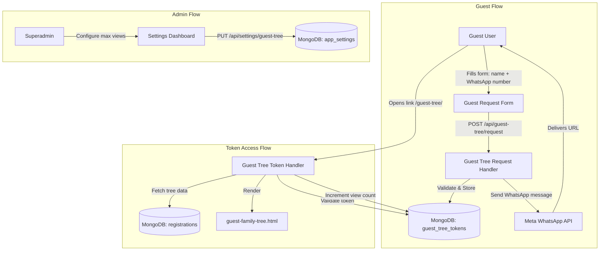
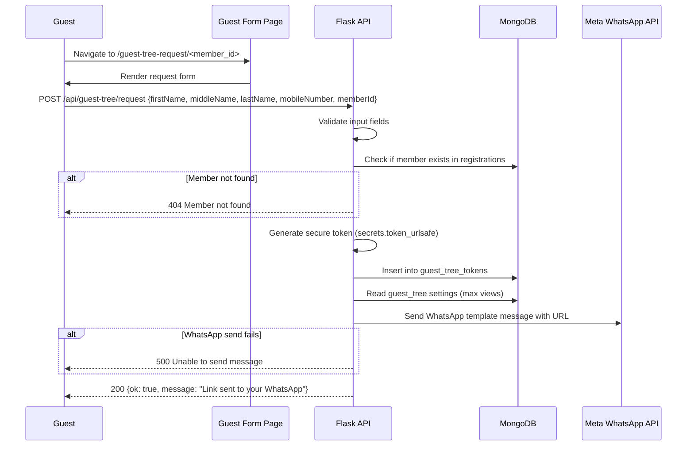
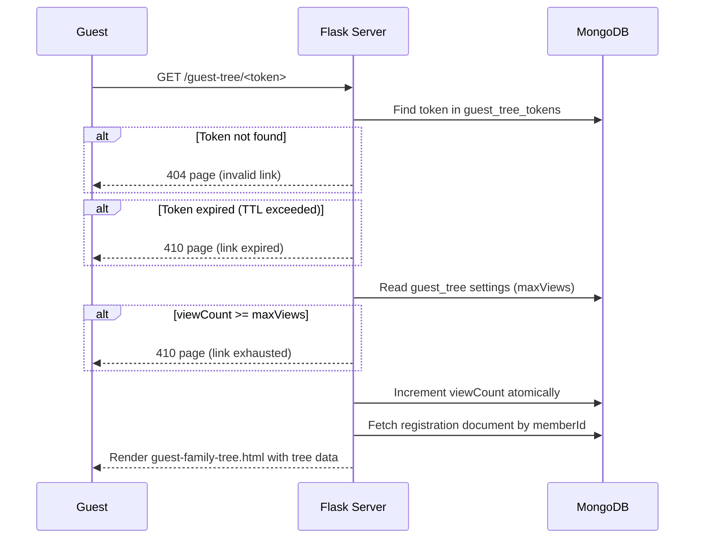
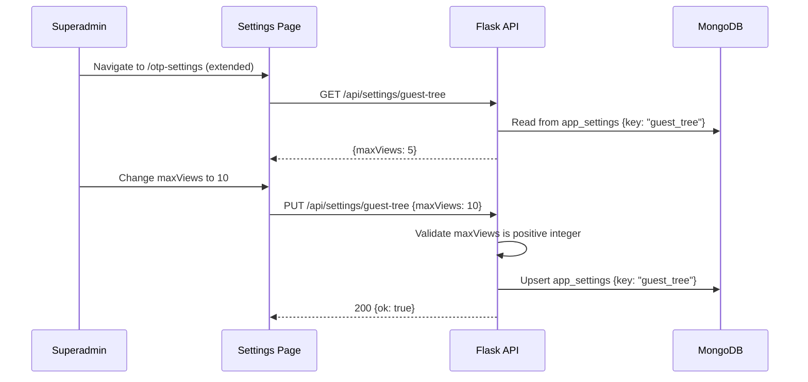

# Design Document: Guest Tree Viewer

## Overview

The Guest Tree Viewer feature allows non-registered users to view a family tree without creating an account. A guest provides their first name, middle name, last name, and WhatsApp mobile number through a public form. The system generates a unique, time-limited token URL and sends it to the guest via WhatsApp. The link can only be opened a configurable number of times (X), after which it becomes invalid. The superadmin can configure the value of X from their dashboard.

This feature extends the existing family tree viewing capability (currently restricted to authenticated staff/operators) by creating a controlled, link-based access mechanism. It leverages the existing Meta WhatsApp Business API integration already used for OTP delivery, and the existing `/api/family-tree/<id>` data endpoint for rendering the tree.

## Architecture



## Sequence Diagrams

### Guest Requesting a Tree Link



### Guest Opening the Tree Link



### Superadmin Configuring Max Views



## Components and Interfaces

### Component 1: Guest Tree Request Handler

**Purpose**: Accepts guest requests, generates tokens, stores them, and triggers WhatsApp delivery.

**Interface**:
```python
@app.post("/api/guest-tree/request")
def request_guest_tree_link():
    """
    Request body:
        {
            "firstName": str,
            "middleName": str,
            "lastName": str,
            "mobileNumber": str,  # with country code e.g. +919876543210
            "memberId": str       # ObjectId of the registration to view
        }
    
    Response (success):
        {"ok": True, "message": "Link sent to your WhatsApp"}
    
    Response (error):
        {"error": str}, 400|404|500
    """
    pass
```

**Responsibilities**:
- Validate all input fields are present and non-empty
- Normalize mobile number (reuse existing `normalize_phone`)
- Verify the target member exists in the registrations collection
- Generate a cryptographically secure token via `secrets.token_urlsafe(32)`
- Store token document in `guest_tree_tokens` collection
- Send WhatsApp message with the generated URL
- Rate-limit requests per mobile number (max 3 active tokens)

### Component 2: Guest Tree Token Viewer

**Purpose**: Validates a token, checks usage limits, increments view count, and renders the family tree.

**Interface**:
```python
@app.get("/guest-tree/<token>")
def view_guest_tree(token):
    """
    URL param:
        token: str (44-char URL-safe base64 token)
    
    Renders: guest-family-tree.html on success
    Renders: error page on invalid/expired/exhausted token
    """
    pass
```

**Responsibilities**:
- Look up token in `guest_tree_tokens` collection
- Verify token exists and has not expired
- Check `viewCount < maxViews` (read maxViews from settings)
- Atomically increment `viewCount`
- Fetch the registration document by `memberId`
- Build the family tree graph data (reuse `build_family_tree_graph_data`)
- Render a guest-specific template (no auth header, no edit controls)

### Component 3: Guest Tree Settings API

**Purpose**: Allows superadmin to configure the maximum number of views per guest token.

**Interface**:
```python
@app.get("/api/settings/guest-tree")
def get_guest_tree_settings():
    """
    Requires: super_admin role
    Response: {"maxViews": int, "tokenTtlHours": int}
    """
    pass

@app.put("/api/settings/guest-tree")
def update_guest_tree_settings():
    """
    Requires: super_admin role
    Request body: {"maxViews": int, "tokenTtlHours": int}
    Response: {"ok": True, "settings": {...}}
    """
    pass
```

**Responsibilities**:
- Enforce `super_admin` role via `require_role("super_admin")`
- Validate `maxViews` is a positive integer (1-100)
- Validate `tokenTtlHours` is a positive integer (1-720, default 72)
- Store in `app_settings` collection with key `"guest_tree"`

### Component 4: Guest Tree Request Form Page

**Purpose**: Public-facing page where guests enter their details to request a tree link.

**Interface**:
```python
@app.get("/guest-tree-request/<member_id>")
def guest_tree_request_page(member_id):
    """
    Public route (no auth required).
    Renders a form asking for first name, middle name, last name, WhatsApp number.
    The member_id is embedded in the form as a hidden field.
    """
    pass
```

**Responsibilities**:
- Verify the member_id is a valid ObjectId format (but no auth check)
- Render the `guest-tree-request.html` template
- Include member_id as a hidden form field

## Data Models

### Guest Tree Token

```python
guest_tree_token = {
    "_id": ObjectId,                    # Auto-generated
    "token": str,                       # 44-char URL-safe token (indexed, unique)
    "memberId": ObjectId,               # Reference to registrations collection
    "guestFirstName": str,              # Guest's first name
    "guestMiddleName": str,             # Guest's middle name
    "guestLastName": str,               # Guest's last name
    "guestMobileNumber": str,           # Normalized WhatsApp number
    "viewCount": int,                   # Number of times the link was opened (starts at 0)
    "maxViewsAtCreation": int,          # Snapshot of maxViews setting at token creation time
    "whatsappProviderRef": str,         # WhatsApp message ID for tracking
    "createdAt": datetime,              # UTC timestamp
    "expiresAt": datetime,              # UTC timestamp (createdAt + tokenTtlHours)
}
```

**Validation Rules**:
- `token` must be unique (unique index)
- `memberId` must reference a valid registration
- `guestFirstName` must be non-empty string
- `guestLastName` must be non-empty string
- `guestMobileNumber` must pass `normalize_phone` validation
- `viewCount` starts at 0, only incremented atomically
- `expiresAt` must be in the future at creation time

**Indexes**:
- `token`: unique index (primary lookup)
- `guestMobileNumber`: index (for rate-limiting queries)
- `expiresAt`: TTL index (auto-delete expired tokens after 30 days)

### Guest Tree Settings (in app_settings collection)

```python
guest_tree_settings = {
    "_id": ObjectId,
    "key": "guest_tree",                # Fixed key for this feature
    "maxViews": int,                    # Default: 5, configurable by superadmin
    "tokenTtlHours": int,              # Default: 72 (3 days)
    "updatedAt": datetime,
    "updatedBy": str,                   # Username of superadmin who last modified
}
```

**Validation Rules**:
- `maxViews` must be integer between 1 and 100
- `tokenTtlHours` must be integer between 1 and 720 (30 days max)

## Algorithmic Pseudocode

### Token Generation Algorithm

```python
def generate_guest_tree_token(member_id, guest_info, settings):
    """
    Generate a secure guest tree access token.
    
    Input: member_id (ObjectId), guest_info (dict), settings (dict)
    Output: token_document (dict)
    """
    # Preconditions
    assert member_id is not None
    assert guest_info["firstName"].strip() != ""
    assert guest_info["lastName"].strip() != ""
    assert normalize_phone(guest_info["mobileNumber"]) is not None
    
    token = secrets.token_urlsafe(32)  # 43-char URL-safe string
    now = now_utc()
    ttl_hours = settings.get("tokenTtlHours", 72)
    expires_at = now + timedelta(hours=ttl_hours)
    
    token_document = {
        "token": token,
        "memberId": member_id,
        "guestFirstName": guest_info["firstName"].strip(),
        "guestMiddleName": guest_info.get("middleName", "").strip(),
        "guestLastName": guest_info["lastName"].strip(),
        "guestMobileNumber": normalize_phone(guest_info["mobileNumber"]),
        "viewCount": 0,
        "maxViewsAtCreation": settings.get("maxViews", 5),
        "whatsappProviderRef": "",
        "createdAt": now,
        "expiresAt": expires_at,
    }
    
    # Postconditions
    assert token_document["viewCount"] == 0
    assert token_document["expiresAt"] > now
    assert len(token_document["token"]) >= 32
    
    return token_document
```

### Token Validation Algorithm

```python
def validate_guest_tree_token(token_string, settings):
    """
    Validate a guest tree token for viewing access.
    
    Input: token_string (str), settings (dict with maxViews)
    Output: (is_valid: bool, reason: str, token_doc: dict | None)
    """
    # Preconditions
    assert token_string is not None
    assert isinstance(token_string, str)
    
    token_doc = guest_tree_tokens_collection.find_one({"token": token_string})
    
    if token_doc is None:
        return (False, "not_found", None)
    
    now = now_utc()
    
    if now > token_doc["expiresAt"]:
        return (False, "expired", token_doc)
    
    max_views = settings.get("maxViews", 5)
    
    if token_doc["viewCount"] >= max_views:
        return (False, "exhausted", token_doc)
    
    # Postconditions
    # If valid: token exists, not expired, and under view limit
    assert token_doc is not None
    assert now <= token_doc["expiresAt"]
    assert token_doc["viewCount"] < max_views
    
    return (True, "valid", token_doc)
```

### Atomic View Count Increment

```python
def increment_view_count(token_string, max_views):
    """
    Atomically increment view count with optimistic concurrency check.
    
    Input: token_string (str), max_views (int)
    Output: (success: bool, new_count: int)
    
    Uses findOneAndUpdate with viewCount < maxViews condition
    to prevent race conditions where multiple simultaneous requests
    could exceed the limit.
    """
    # Preconditions
    assert token_string is not None
    assert max_views > 0
    
    result = guest_tree_tokens_collection.find_one_and_update(
        {
            "token": token_string,
            "viewCount": {"$lt": max_views},
        },
        {
            "$inc": {"viewCount": 1},
        },
        return_document=True,  # Return updated document
    )
    
    if result is None:
        # Either token not found or viewCount already >= maxViews
        return (False, -1)
    
    new_count = result["viewCount"]
    
    # Postconditions
    assert new_count <= max_views
    assert new_count > 0
    
    return (True, new_count)
```

### Rate Limiting Algorithm

```python
def check_rate_limit(mobile_number, max_active_tokens=3):
    """
    Ensure a mobile number doesn't have too many active tokens.
    
    Input: mobile_number (str), max_active_tokens (int)
    Output: (allowed: bool, active_count: int)
    """
    # Preconditions
    assert mobile_number is not None
    assert max_active_tokens > 0
    
    now = now_utc()
    
    active_count = guest_tree_tokens_collection.count_documents({
        "guestMobileNumber": mobile_number,
        "expiresAt": {"$gt": now},
    })
    
    allowed = active_count < max_active_tokens
    
    # Postconditions
    assert active_count >= 0
    # If allowed is True, adding one more token keeps total <= max_active_tokens
    
    return (allowed, active_count)
```

## Key Functions with Formal Specifications

### Function: request_guest_tree_link()

```python
@app.post("/api/guest-tree/request")
def request_guest_tree_link():
    pass
```

**Preconditions:**
- Request body is valid JSON
- `firstName` is non-empty string
- `lastName` is non-empty string
- `mobileNumber` passes `normalize_phone()` validation
- `memberId` is a valid 24-char hex string (ObjectId format)

**Postconditions:**
- On success: a new document exists in `guest_tree_tokens` with `viewCount == 0`
- On success: a WhatsApp message was sent (or test mode simulated)
- On success: response is `{"ok": True, "message": "..."}`
- On validation failure: response is 400 with error description
- On member not found: response is 404
- The total number of active tokens for this mobile number does not exceed 3

**Loop Invariants:** N/A

### Function: view_guest_tree(token)

```python
@app.get("/guest-tree/<token>")
def view_guest_tree(token):
    pass
```

**Preconditions:**
- `token` is a non-empty string from the URL path

**Postconditions:**
- If token is valid and under limit: `viewCount` is incremented by exactly 1 (atomically)
- If token is valid: renders family tree template with correct member data
- If token is invalid/expired/exhausted: renders appropriate error page
- No authentication session is created (guest remains unauthenticated)

**Loop Invariants:** N/A

### Function: update_guest_tree_settings()

```python
@app.put("/api/settings/guest-tree")
def update_guest_tree_settings():
    pass
```

**Preconditions:**
- Caller has `super_admin` role (session-based check)
- Request body contains `maxViews` as integer in range [1, 100]
- Request body contains `tokenTtlHours` as integer in range [1, 720]

**Postconditions:**
- Settings document in `app_settings` is created or updated
- `updatedAt` reflects current UTC time
- `updatedBy` reflects the superadmin's username
- Existing tokens are NOT retroactively affected (they use `maxViewsAtCreation`)

**Loop Invariants:** N/A

## Example Usage

```python
# Example 1: Guest requests a tree link
import requests

response = requests.post("http://localhost:5000/api/guest-tree/request", json={
    "firstName": "Ramesh",
    "middleName": "Suresh",
    "lastName": "Patil",
    "mobileNumber": "+919876543210",
    "memberId": "507f1f77bcf86cd799439011",
})
# Response: {"ok": True, "message": "Link sent to your WhatsApp"}

# Example 2: Guest opens the link (browser request)
# GET /guest-tree/aBcDeFgHiJkLmNoPqRsTuVwXyZ1234567890_abc
# Renders the family tree page if token is valid

# Example 3: Superadmin configures max views
response = requests.put(
    "http://localhost:5000/api/settings/guest-tree",
    json={"maxViews": 10, "tokenTtlHours": 48},
    cookies={"session": superadmin_session_cookie},
)
# Response: {"ok": True, "settings": {"maxViews": 10, "tokenTtlHours": 48}}

# Example 4: Token exhausted after X views
# GET /guest-tree/<token> when viewCount >= maxViews
# Renders: "This link has been used the maximum number of times."
```

## Correctness Properties

*A property is a characteristic or behavior that should hold true across all valid executions of a system—essentially, a formal statement about what the system should do. Properties serve as the bridge between human-readable specifications and machine-verifiable correctness guarantees.*

### Property 1: Token generation invariant

*For any* valid guest info (non-empty first name, non-empty last name, valid phone number) and valid settings, generating a token SHALL always produce a document with viewCount equal to 0 and expiresAt equal to createdAt plus the configured TokenTtlHours.

**Validates: Requirements 1.1, 3.3**

### Property 2: Input validation rejects invalid guest details

*For any* string composed entirely of whitespace (or empty), submitting it as a first name or last name SHALL result in HTTP 400 rejection. *For any* string that fails phone normalization, submitting it as a mobile number SHALL result in HTTP 400 rejection.

**Validates: Requirements 1.4, 1.5, 1.6**

### Property 3: Token validation denies invalid states

*For any* token string not present in the database, validation SHALL return "not_found". *For any* token with expiresAt in the past, validation SHALL return "expired". *For any* token with viewCount greater than or equal to MaxViews, validation SHALL return "exhausted".

**Validates: Requirements 2.2, 2.3, 2.4**

### Property 4: Valid token access increments view count by exactly 1

*For any* token with viewCount strictly less than MaxViews and expiresAt in the future, accessing the token SHALL increment viewCount by exactly 1 and the resulting viewCount SHALL never exceed MaxViews.

**Validates: Requirements 2.1, 2.5**

### Property 5: Token format validity

*For any* generated token, the token string SHALL contain only characters from the URL-safe set (A-Z, a-z, 0-9, hyphen, underscore) and SHALL have a length of at least 43 characters (corresponding to 32 bytes of randomness).

**Validates: Requirements 3.1, 3.4**

### Property 6: Rate limit enforcement

*For any* mobile number with 3 or more active (non-expired) tokens, a new token request for that number SHALL be rejected with HTTP 429.

**Validates: Requirements 4.1, 4.2**

### Property 7: Settings validation accepts valid ranges and rejects invalid

*For any* integer in the range [1, 100], updating MaxViews SHALL succeed. *For any* integer outside [1, 100], updating MaxViews SHALL be rejected with HTTP 400. *For any* integer in [1, 720], updating TokenTtlHours SHALL succeed. *For any* integer outside [1, 720], updating TokenTtlHours SHALL be rejected.

**Validates: Requirements 5.2, 5.3, 5.5, 5.6**

### Property 8: Authorization enforcement

*For any* user without the super_admin role, accessing the settings API SHALL result in HTTP 403 rejection regardless of the request payload.

**Validates: Requirements 5.4**

### Property 9: Session isolation

*For any* guest tree view request (valid or invalid token), the Token_Handler SHALL not create or modify any Flask session data.

**Validates: Requirements 6.1**

### Property 10: Invalid ObjectId rejection in form URL

*For any* string that is not a valid 24-character hexadecimal ObjectId, navigating to the guest request form with that string as the member ID SHALL render an error page.

**Validates: Requirements 7.3**

## Error Handling

### Error Scenario 1: Invalid Input on Request

**Condition**: Guest submits form with missing or invalid fields (empty name, invalid phone number, malformed member ID).
**Response**: HTTP 400 with `{"error": "..."}` describing the first validation failure.
**Recovery**: Guest corrects the form and resubmits.

### Error Scenario 2: Member Not Found

**Condition**: The `memberId` provided does not exist in the registrations collection.
**Response**: HTTP 404 with `{"error": "Member not found"}`.
**Recovery**: The link to the request form should only be shared for valid members (from the directory).

### Error Scenario 3: Rate Limit Exceeded

**Condition**: Guest's mobile number already has 3 active (non-expired) tokens.
**Response**: HTTP 429 with `{"error": "Too many active links. Please wait for existing links to expire."}`.
**Recovery**: Guest waits for existing tokens to expire, or uses previously received links.

### Error Scenario 4: WhatsApp Delivery Failure

**Condition**: Meta WhatsApp API returns an error or times out.
**Response**: HTTP 500 with `{"error": "Unable to send WhatsApp message. Please try again."}`. Token is still created but marked with empty `whatsappProviderRef`.
**Recovery**: Guest retries the request. Token with failed delivery will expire naturally.

### Error Scenario 5: Token Not Found

**Condition**: Guest visits `/guest-tree/<token>` with a token that doesn't exist in the database.
**Response**: Renders a friendly error page: "This link is invalid or has been removed."
**Recovery**: Guest requests a new link.

### Error Scenario 6: Token Expired

**Condition**: Guest visits a valid token URL after `expiresAt` has passed.
**Response**: Renders error page: "This link has expired. Please request a new one."
**Recovery**: Guest requests a new link through the original form.

### Error Scenario 7: Token View Limit Exhausted

**Condition**: Guest visits token URL when `viewCount >= maxViews`.
**Response**: Renders error page: "This link has been used the maximum number of times."
**Recovery**: Guest requests a new link.

## Testing Strategy

### Unit Testing Approach

- Test `generate_guest_tree_token` with various inputs (valid, edge cases)
- Test `validate_guest_tree_token` with all three failure modes (not found, expired, exhausted)
- Test `check_rate_limit` with boundary conditions (0, 2, 3 active tokens)
- Test `normalize_phone` with WhatsApp number formats
- Test settings validation (boundary values for maxViews and tokenTtlHours)
- Test `increment_view_count` returns correct boolean and count

### Property-Based Testing Approach

**Property Test Library**: Hypothesis (Python)

- **Property 1**: For any valid guest info and settings, `generate_guest_tree_token` always produces a token with `viewCount == 0` and `expiresAt > createdAt`.
- **Property 2**: For any token with `viewCount >= maxViews`, `validate_guest_tree_token` always returns `(False, "exhausted", ...)`.
- **Property 3**: For any token with `expiresAt` in the past, `validate_guest_tree_token` always returns `(False, "expired", ...)`.
- **Property 4**: The generated token string is always URL-safe (matches `[A-Za-z0-9_-]+`).

### Integration Testing Approach

- Full request flow: POST request → token stored → WhatsApp call made (mocked) → response contains success
- Full view flow: Create token → GET `/guest-tree/<token>` → renders tree → viewCount incremented
- Exhaustion flow: Create token → view X times → (X+1)th view returns error
- Settings update: superadmin updates maxViews → new tokens respect new value
- Rate limit: Create 3 tokens for same number → 4th request returns 429

## Performance Considerations

- **Token lookup**: The unique index on `token` ensures O(log n) lookup time for each guest tree view.
- **Rate limit query**: Index on `guestMobileNumber` + filter on `expiresAt` ensures efficient rate-limit checks.
- **TTL index on expiresAt**: MongoDB automatically purges expired token documents, preventing unbounded collection growth. Set TTL to expire 30 days after `expiresAt` to keep audit trail briefly.
- **Atomic updates**: Using `find_one_and_update` with filter conditions avoids the need for application-level locking on view count increments.
- **WhatsApp API latency**: The WhatsApp API call (typically 200-500ms) is synchronous. For MVP this is acceptable. If needed later, can be moved to a background task.

## Security Considerations

- **Token entropy**: `secrets.token_urlsafe(32)` provides 256 bits of randomness, making brute-force guessing infeasible (2^256 possibilities).
- **No authentication bypass**: Guest tree viewing does not create any session or grant any privileges. The guest can ONLY view the specific tree linked to their token.
- **Rate limiting**: Prevents abuse of the WhatsApp sending feature (max 3 active tokens per number).
- **Input sanitization**: All guest inputs are stripped/cleaned before storage. Mobile numbers pass through `normalize_phone`.
- **No PII exposure in URL**: The token is opaque — it does not encode the member ID or guest information.
- **HTTPS only**: The generated URLs should use the app's configured base URL (which should be HTTPS in production).
- **WhatsApp verification**: The guest must have access to the WhatsApp number they provide — this acts as implicit verification that a real person is requesting access.

## Dependencies

- **Existing**: `secrets` (stdlib), `datetime` (stdlib), `flask`, `pymongo`, `requests`
- **Existing integration**: Meta WhatsApp Business API (already configured for OTP, uses `send_template_graph` pattern with Graph API v24.0)
- **New collection**: `guest_tree_tokens` in the same MongoDB database
- **New setting key**: `"guest_tree"` in the `app_settings` collection
- **New WhatsApp template**: A new message template must be created in the Meta Business Manager for sending tree URLs (separate from the OTP template)
- **New templates**: `guest-tree-request.html`, `guest-family-tree.html`, `guest-tree-error.html`
- **New static JS**: `guest-tree-request.js` for form handling
